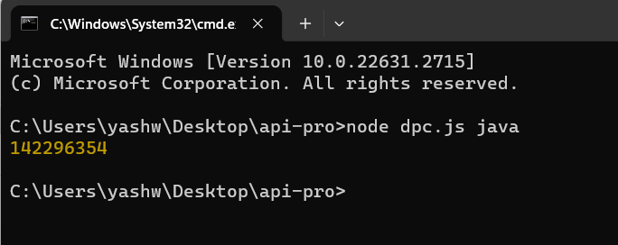

# Live-pull-count-for-Docker-images

Live pull count for Docker images using js

# Prerequisites

Node.js installed on your machine. You can download it here.

# Installation

1.Clone the repository to your local machine:

git clone https://github.com/your-username/your-repository.git

2.Navigate to the project directory:

cd your-repository

3.Install the required Node.js packages:

npm install

# Usage

Run the script from the command line with the Docker image name as an argument

node script.js <imageName>

# Example

node script.js nginx
